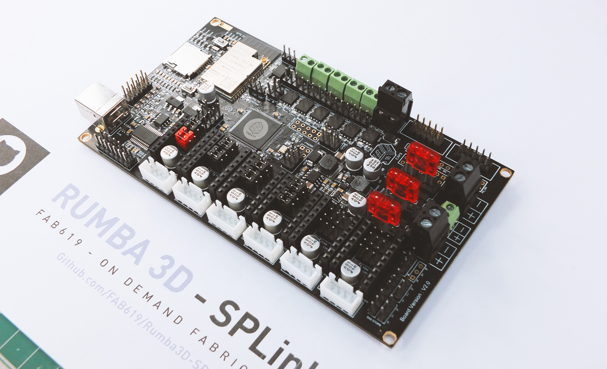
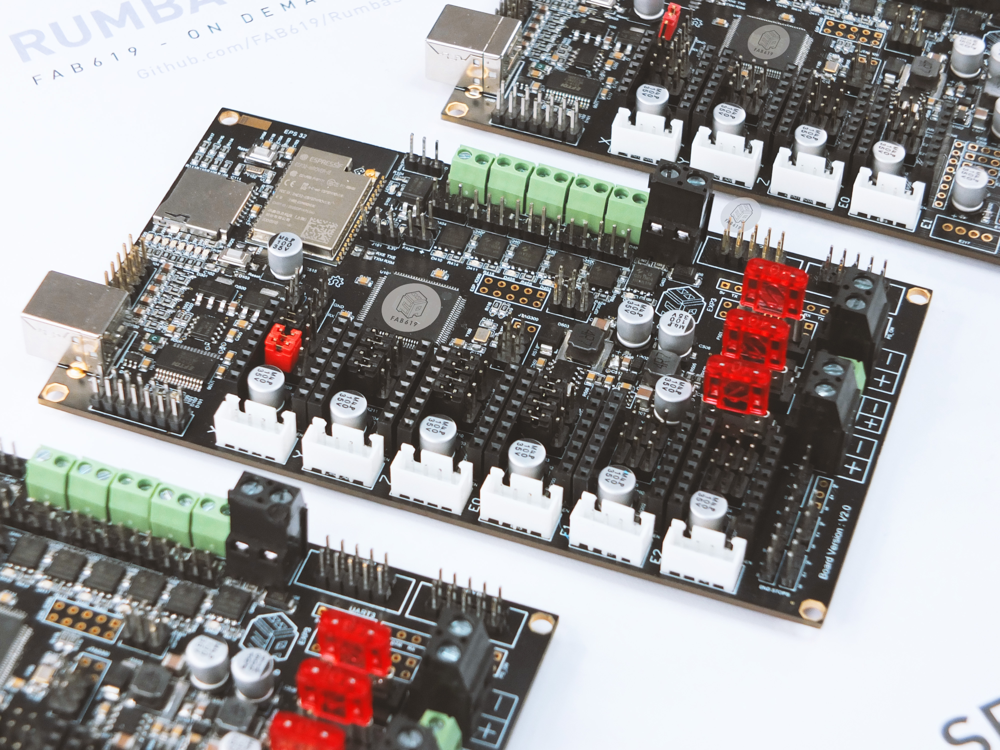
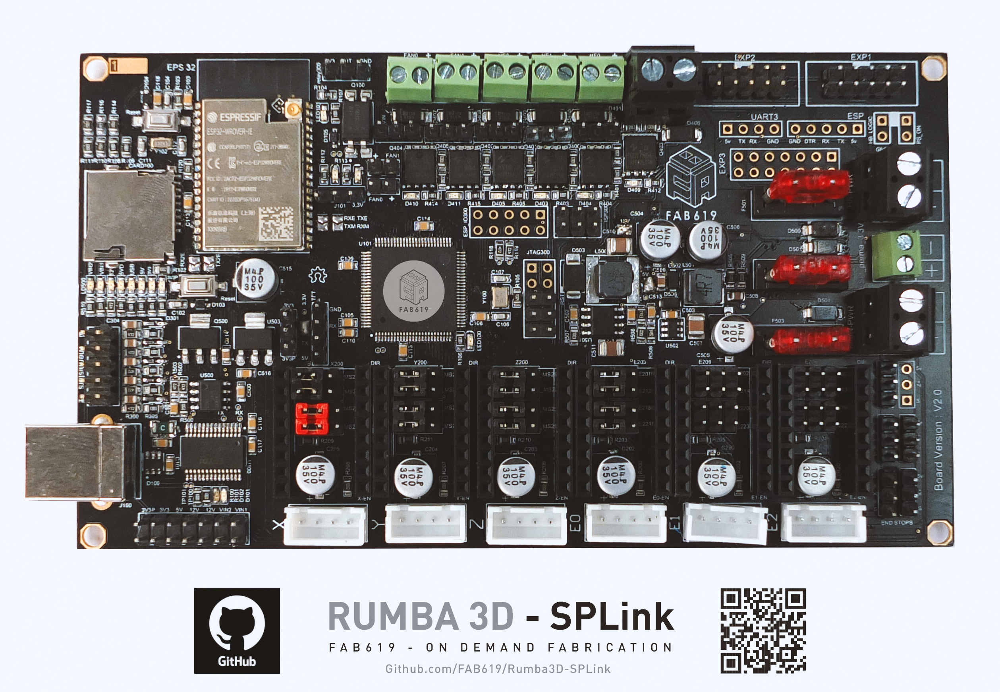
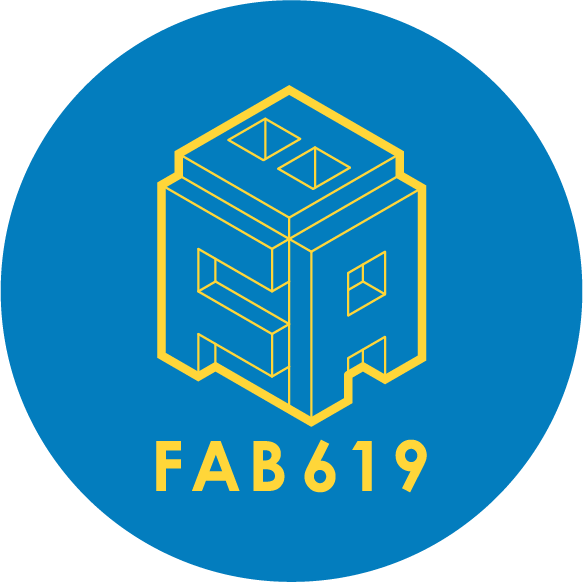

# Rumba3D-SPLink

The **"Rumba SpLink"** is an innovative and feature-rich 3D printer board that takes your printing experience to the next level. With its ESP connectivity, LCD screen and TFT support, and compatibility with Marlin firmware and Klipper on Raspberry Pi, this board is designed to provide seamless control and enhanced connectivity for your 3D printer.

The name "Rumba SpLink" perfectly captures the essence of this board. By combining the trusted RUMBA board with the "ESP Link" module, it signifies a smart and efficient link between your printer's components and external devices. The connectivity capabilities offered by the ESP technology allow for easy and convenient control and monitoring of your printer.

With its LCD screen and TFT support, the "Rumba SpLink" provides a clear and intuitive interface for navigating through settings, adjusting parameters, and monitoring print progress. The compatibility with Marlin firmware and Klipper on Raspberry Pi ensures flexibility and adaptability to various software environments, empowering you to customize and optimize your printing workflow.

Whether you're a hobbyist or a professional, the "Rumba SpLink" offers a reliable and versatile solution that simplifies the printing process while delivering exceptional results. Experience enhanced connectivity, seamless control, and an intuitive user interface with the "Rumba SpLink" 3D printer board.

Specifications 
-

Firmware Support
-

This board is curently supported by the following firmwares: 
- [Marlin 2.0 (Bugfix 2.0.9)](hhttps://github.com/MarlinFirmware/Marlin/releases/tag/2.0.9.5)

- [Klipper3D](https://www.klipper3d.org/)

Author
-
**Rumba3D-SpLink** 3D Printer board has been designed and built by **[Fab619 On-Demand-Fabrication](https://fab619.tn/)**

PCB Board Desinger: 
- **[Haithem LTIFI](https://www.linkedin.com/in/haythemltifi/)**
- **[Kais ALILA](http://fabacademy.org/2020/labs/kamplintfort/students/kais-alila/)**

License 
-
In keeping with the original RUMBA design, this version of rumba is fully open .
source. 
Hardware design, PCB files and BOM, settings and other technical or design files are released under the following license:

- GNU GENERAL PUBLIC LICENSE Version 2 Licence - **[GPLv2](GPLv2.txt)**

Assembly, pictures, videos, presentations, description text and other type of media are released under the following license:

- Creative-Commons-Attribution-ShareAlike 4.0 International - **[CC BY-SA 4.0](LICENSE_CC_BY_SA_4.0.txt)**

Acknowledgement
---
Rumba3D-Splink is a version of the RUMBA 3D Printer control board. Rumba3D-Splink is derived from the Aus3D RUMBA+ design and Rumba32 design, which is an overhauled version of the original RUMBA.

Rumba3D-Splink combines the improved RUMBA+ design with a powerful 32-bit ESP32-WROOVER-IE microcontroller module added for more features.

Note
-
This documentation will be continuously improved as soon there are updates and/or improvements on the machine.

# Disclaimer

This hardware/software is provided "as is", and you use the hardware/software at your own risk. Under no circumstances shall any author be liable for direct, indirect, special, incidental, or consequential damages resulting from the use, misuse, or inability to use this hardware/software, even if the authors have been advised of the possibility of such damages.